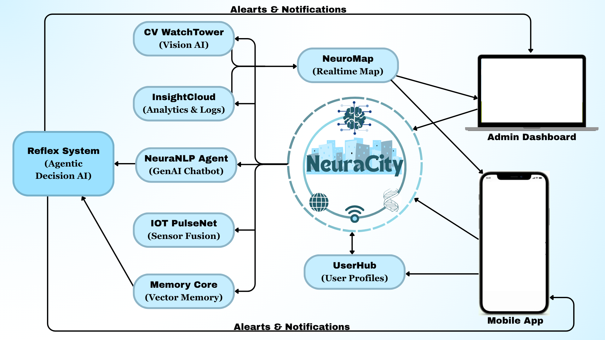

# 🧠 NeuraCity — AI Nervous System for Smart Campuses

NeuraCity is a full-stack, AI-first intelligent system designed to bring real-time awareness, safety, insights, and automation to physical institutions like college campuses, hospitals, airports, and smart cities.  

> Think of it as the **AI nervous system** for any multi-building campus — sensing, analyzing, and acting across modalities.



---

## 🚨 Problem

Modern institutions lack intelligent, unified systems that can:
- Detect emergencies or distress in real-time
- Understand crowd and engagement behavior
- Provide seamless, personalized interactions
- Fuse data from cameras, sensors, systems, and chat interfaces
- Automate critical actions across infrastructure

---

## 🧠 The Vision

NeuraCity solves this by bringing together:
- 🔍 Computer Vision for real-world event detection
- 🎙️ Audio + NLP + GenAI for natural interactions
- 📊 Data Science dashboards for insights
- 🤖 IoT for environmental and personal sensing
- 🧠 Memory + Agentic AI for real-time, contextual automation

---

## 📦 Repository Structure

```bash
NeuraCity/
├── backend/                            # FastAPI APIs, database models
├── frontend/                           # React + Tailwind or Streamlit dashboards
├── memorycore/ 						# Vector memory logs
├── modules/                            # Independent modules (CV, NLP, IoT, etc.)
│   ├── cv_watchtower/                  # Fall, loitering, lone female detection
│   ├── reflex_system/                  # Autonomous response engine
│   ├── neuranlp_agent/                 # GenAI chatbot + autonomous actions
│   ├── iot_pulsenet/                   # Pulse, gas, IR sensors with triggers
│   ├── insightcloud/                   # Attendance, sentiment, air quality dashboards
│   ├── userhub/                        # Login/Logout, roles, presence               
│   ├── alerts_and_notifications/       # Admin alerts, notices, push-to-announce
│   └── neuromap/                       # Leaflet-based real-time campus map
├── deployment/                         # Docker, requirements.txt, .env
├── docs/                               # Design docs, architecture, pitch deck
├── tests/                              # All unit/integration tests
├── .gitignore
├── CONTRIBUTING.md
├── LICENSE
└── README.md
```

---

## 🚀 MVP Goals (8–10 Weeks)
	•	✅ Vision model detects: fall, distress, raised hand, lone woman
	•	✅ IoT triggers: pulse drop, motion in restricted zones
	•	✅ GenAI chatbot: answers institutional queries
	•	✅ InsightCloud: trends in attendance, events, occupancy
	•	✅ MemoryCore: ask what happened in any zone/time
	•	✅ ReflexSystem: auto-trigger emergency emails/alerts

---

## 🛠 Tech Stack

| Layer       | Tools                                       |
|-------------|---------------------------------------------|
| CV          | YOLOv8, OpenCV, TensorFlow                  |
| NLP         | LangChain, OpenAI/Ollama                    |
| Backend     | FastAPI, SQLite/PostgreSQL                  |
| Frontend    | React/Next.js, TailwindCSS, Leaflet.js      |
| IoT         | Arduino, Raspberry Pi, Embedded C, Python   |
| DS          | Pandas, Plotly, Scikit-Learn                |
| MLOps       | Docker, GitHub Actions (optional)           |

---

## 👥 Contributors

| Name         | Role                       |
|--------------|----------------------------|

See CONTRIBUTING.md for contribution rules and folder ownership.

---

## 📄 License

Licensed under the MIT License. See LICENSE for details.

---

## 🙌 Join the Mission

Want to deploy NeuraCity in your own campus or city?
Create an issue or fork the project and let’s co-build the future of smart institutions.

---
