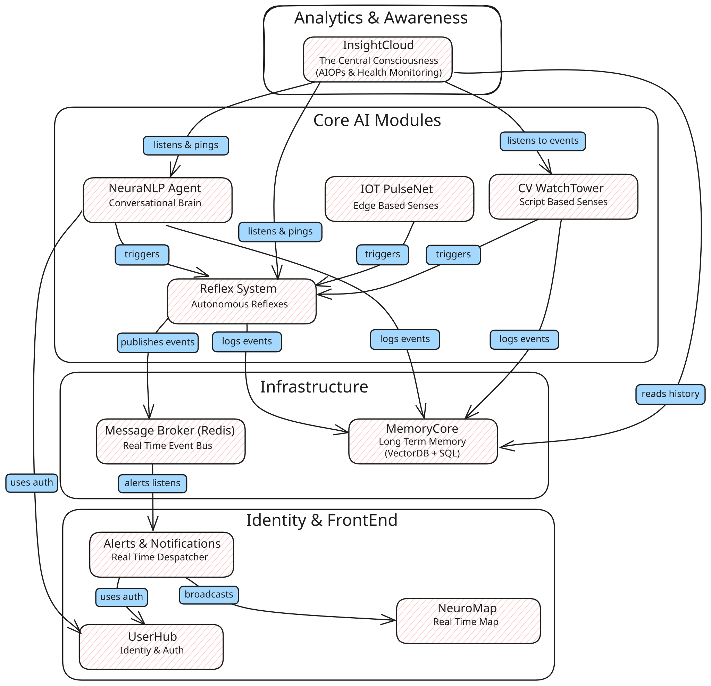

# 🏙️ NeuraCity: The AI Nervous System for Smart Institutions

[](./LICENSE)
> A full-stack, multi-modal, AIOps-enabled platform designed to bring real-time awareness, safety, and intelligence to physical spaces.
> Lovingly co-created by **Swayam and his wife.**

**NeuraCity** is a complete, modular AI ecosystem that acts as the intelligent core for smart campuses, hospitals, or corporate facilities. It integrates Computer Vision, Conversational AI, and IoT sensor data into a single, cohesive platform that can **see, feel, remember, think, act, and speak.**

---

## 🏛️ Live Architecture

NeuraCity is built on a robust, decoupled microservices architecture. Each module is an independent service that communicates through a combination of REST APIs and a central Redis event bus, creating a resilient and highly scalable system.


### BackEnd Architecture



---

## ✨ Core Features & Implemented Modules

- ### 🧠 neuranlp_agent (The Brain):
  A stateful, conversational AI powered by Google Gemini and LangChain. It can answer factual questions, hold multi-turn conversations, and use tools to interact with other system modules.
- ### 👁️ cv_watchtower (The Eyes):
  A high-performance, multi-stream surveillance module using YOLOv8 with Apple Silicon (MPS) acceleration. It detects complex real-world events like falls, violence, loitering, abandoned objects, and fire.
- ### ⚡ iot_pulsenet (The Senses):
  An intelligent MicroPython application for the Raspberry Pi Pico W that performs Edge AI. It locally monitors biometric (pulse) and environmental (gas, temperature) sensors, only contacting the backend when a critical event is detected.
- ### 🦾 reflex_system (The Reflexes):
  The autonomous action and AIOps engine. It receives triggers from other modules, logs events, publishes them to Redis, and autonomously monitors the health of the entire platform, triggering alerts if a service fails.
- ### 📚 memorycore (The Memory):
  A sophisticated, dual-backend memory system. It uses ChromaDB for long-term semantic storage of conversations and PostgreSQL/SQLite for a structured, auditable log of all system events.
- ### 👤 userhub (The Identity):
  A production-ready identity service using PostgreSQL, SQLAlchemy, and JWT. It manages user profiles, attendance, and provides secure, Role-Based Access Control (RBAC) for the entire platform.
- ### ☁️ insightcloud (The Consciousness):
  The central AIOps and analytics hub. It monitors system health, performs anomaly detection, and provides API endpoints for the frontend dashboard.
- ### 📢 alerts_and_notifications (The Voice):
  The real-time notification dispatcher. It listens to Redis events and intelligently routes polished, human-readable alerts to the correct users (based on their role) via WebSockets and Webhooks.
- ### 🗺️ neuromap (The Vision):**
  A stunning, visually breathtaking interactive map built with Vue.js and Leaflet.js. It connects to the alerts WebSocket to provide a live, real-time command center view of all map-worthy campus events.

---

## 🛠️ Technology Showcase

| 		Category		|		    Technologies & Concepts Demonstrated				|
|-----------------------|---------------------------------------------------------------|
| AI & Machine Learning	| LLM Agents, Multi-Modal AI, Real-Time CV, Edge AI, Vector DB	|
| Backend Architecture	| Microservices, Event-Driven, AIOps, REST APIs, WebSockets		|
| Security				| JWT Authentication, RBAC, Password Hashing, API Protection	|
| Databases				| PostgreSQL, SQLite, ChromaDB (Vector), Redis (In-Memory)		|
| DevOps & MLOps		| Docker, Alembic Migrations, Centralized Config, Unit Testing	|
| IoT & Embedded		| MicroPython, Raspberry Pi Pico W, Asynchronous Sensor IO		|
| Frontend				| Vue.js 3, Leaflet.js, Vite, Real-Time Data Visualization		|

---

## 🚀 Getting Started: One-Step Backend Launch
This project is architected for a simple, one-command startup.

1. Prerequisites
- Docker Desktop installed and running.
- Python 3.9+ and Node.js installed.
- A configured root .env file with your API keys and database credentials.

2. Setup (One-Time)
```bash
# In the project root

# 1. Install all Python dependencies
pip install -r requirements.txt

# 2. Build the NeuroMap frontend
cd modules/neuromap/frontend
npm install && npm run build
cd ../../.. # Go back to root

# 3. Set up and run the database migrations
alembic upgrade head
```

3. Launch All Services
```bash
# Make it executable (only needs to be done once)
chmod +x backend/run_all_services.sh

# Launch the entire NeuraCity backend platform!
./backend/run_all_services.sh
```
This will launch all core server modules in separate, named terminal tabs. You can then start the cv_watchtower or iot_pulsenet manually to begin generating events.

---

## 🙌 Project Co-Creators
This project was a collaborative effort, combining vision and engineering.

---

📄 License
This project is licensed under the AGPLv3 License. Please see the [LICENSE](./LICENSE) file for details.
