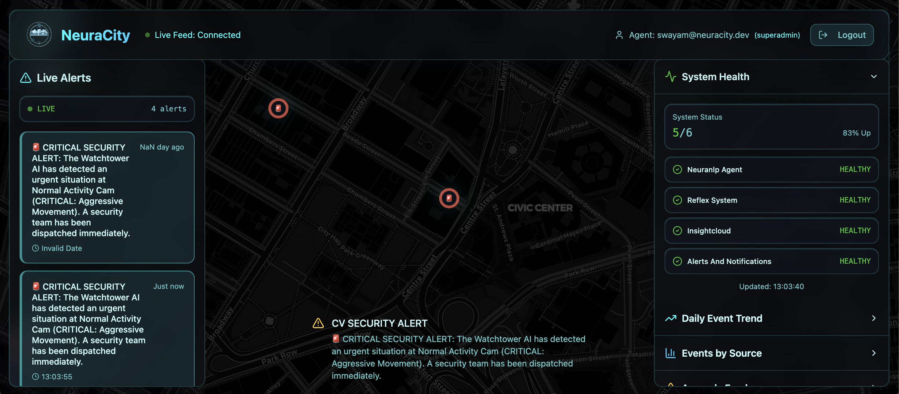
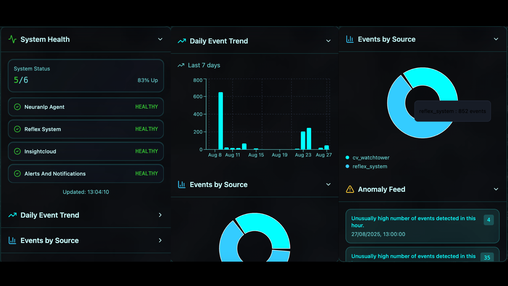

# 🏙️ NeuraCity Command Dashboard

> The definitive, real-time command and control center for the NeuraCity AI platform.

---

## **Project Vision & Purpose**

The NeuraCity Command Dashboard is the **"single pane of glass"** for campus administrators and security personnel. It is a secure, real-time, and visually breathtaking web application that provides complete situational awareness and analytical insights into the entire NeuraCity ecosystem.

It transforms a distributed network of complex AI modules into a single, intuitive, and actionable user interface, allowing operators to monitor campus health, respond to live events, and analyze historical data with unparalleled clarity.



---

## ✨ Core Features

*   **🗺️ Live `NeuroMap` Visualization**: Features a full-screen, interactive map as its centerpiece. Critical events from `cv_watchtower` and `neuranlp_agent` appear **instantly** as stunning, animated, pulsing markers, with the map's camera smoothly flying to each new incident.
*   **📡 Real-Time Alert Feed**: A live, scrolling feed of all significant events across the platform, powered by a persistent, authenticated **WebSocket** connection. Alerts appear the moment they happen.
*   **❤️‍🩹 AIOps System Health Panel**: Provides an at-a-glance overview of the operational status of every backend microservice (`neuranlp_agent`, `reflex_system`, etc.), with statuses (`Healthy`, `Unhealthy`) updated in real-time.
*   **📊 Rich Analytics Suite**: Includes a dedicated analytics page with interactive charts and graphs for:
    *   Historical events per day (bar chart).
    *   Event distribution by source module (pie chart).
    *   Anomalous event spikes detected by the `InsightCloud` ML model.
*   **🔐 Secure & Role-Based**: The entire application is protected by a robust **JWT authentication** system. Future features can be easily restricted based on user roles (e.g., `admin`, `security`) defined in `UserHub`.

---

## 🛠️ Technology Stack

*   **Framework**: `React.js 18` (with Hooks)
*   **Build Tool**: `Vite`
*   **Styling**: `Tailwind CSS` with `Shadcn/ui` for beautiful, accessible components.
*   **State Management**: `Zustand` (a minimalist, fast state management solution).
*   **Mapping Library**: `Leaflet.js` via `React-Leaflet`.
*   **Charting Library**: `ECharts` via `echarts-for-react`.
*   **Real-time Communication**: `WebSockets`.

---

## ⚙️ Setup and Development Workflow

### 1. Prerequisites

*   [Node.js and npm](https://nodejs.org/en) (LTS version) must be installed.
*   The **entire NeuraCity backend platform** (Redis, PostgreSQL, and all Python modules) must be running. Refer to the root `README.md` for instructions.

### 2. Installation

All commands should be run from within this directory (`frontend/admin_panel/`).

```bash
# Install all required npm packages
npm install
```
### 3. Running the Local Development Server

This command starts a hot-reloading development server, which is ideal for making changes.

```bash
npm run dev
```
The dashboard will be available at the URL provided in the terminal `http://localhost:8080/`

---

## 🔗 Backend Integration Points
This frontend application is a pure client for the NeuraCity backend APIs.

### Authentication:
POST http://localhost:8005/auth/token - Used by the Login page to exchange user credentials for a JWT token.

### Real-Time Alerts:
ws://localhost:8003/ws/alerts?token=<JWT_TOKEN> - The authenticated WebSocket endpoint that pushes all live events to the dashboard.

### Analytics & Health:
GET http://localhost:8002/stats/... - The family of endpoints from InsightCloud used to populate the health panel and analytics charts. All calls must include the Authorization: Bearer <JWT_TOKEN> header.



---

## 🚀 How to Contribute & Extend
The application is built with a modular, component-based architecture to make it easy to extend.

- **UI Components:** Located in src/components/. These are small, reusable pieces of the UI (e.g., a chart, a status dot).
- **Views:** Located in src/pages/. These are the main "pages" of the application (e.g., the Dashboard.jsx, LoginPage.jsx).
- **State Management:** Located in src/stores/. The authStore.js uses Zustand to manage the user's token and profile across the entire application.

### To add a new feature, a developer would typically:

- Create a new view component in /src/pages.
- Build any necessary reusable UI components in /src/components.
- Add the API calling logic and connect it to the component's state.
- Add a new route for the page in the main router configuration file.

