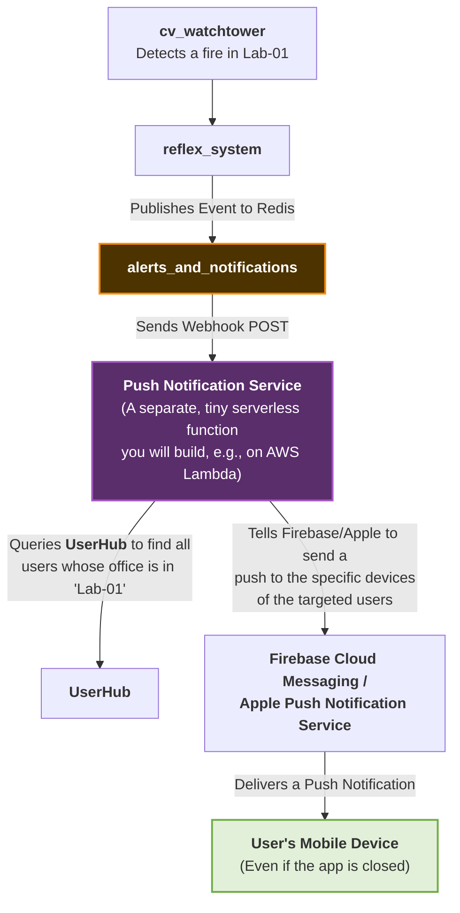

# 📱 NeuraApp: The Smart Campus in Your Pocket

> This document is the official technical specification and developer guide for the NeuraCity companion mobile application.

---

## 1. **Project Vision & Purpose**

`NeuraApp` is the primary mobile interface for students and staff of the NeuraCity smart campus. It is a secure, personalized, and context-aware application that acts as a helpful companion for campus life.

Unlike the operator-focused Admin Dashboard, `NeuraApp` is designed to be user-centric. Its goals are to provide convenience, deliver timely and relevant information, and enhance the safety and well-being of every individual on campus.

## 2. **Core Architectural Requirements**

*   **Technology Stack**: A modern mobile framework like `Flutter`, or native `SwiftUI`/`Kotlin`.
*   **Authentication**: The app **must** have a secure login flow. All subsequent API calls to the NeuraCity backend must be authenticated using the **JWT Bearer Token** obtained from the `UserHub` login endpoint.
*   **Real-Time Push Notifications**: The app must be able to receive critical alerts (e.g., "Fire detected in your building!") even when it is not running in the foreground. This will be implemented using a dedicated Push Notification service.
*   **Personalization**: The app experience must be tailored to the logged-in user's role (`student`, `staff`, etc.) and their personal data stored in `UserHub`.

---

## 3. **Step-by-Step Feature Implementation Guide**

This section breaks down the app's features screen-by-screen.

### **Feature 1: Secure Login & Onboarding**

*   **UI Components:**
    *   Splash Screen
    *   Email & Password Login Screen
*   **Core Logic:**
    1.  This flow is **identical** to the Admin Dashboard's login. The app will make a `POST` request to `http://<your_server_ip>:8005/auth/token`.
    2.  Upon a successful login, the received JWT `access_token` and a `refresh_token` (a great future addition to `UserHub`) must be stored securely in the device's keychain or secure storage.
    3.  **Push Notification Registration**: After a successful login, the app must:
        *   Ask the user for permission to receive push notifications.
        *   Get the device's unique push notification token from the operating system (e.g., from Firebase Cloud Messaging or Apple Push Notification Service).
        *   Send this device token to a (future) `UserHub` endpoint (e.g., `POST /users/me/register-device`) to associate this specific phone with the logged-in user.

---

### **Feature 2: The Main Dashboard Screen (Personalized View)**

This is the home screen of the app. It's a personalized summary of what's relevant to the user right now.

*   **UI Components:**
    *   A "Welcome, [User's Full Name]!" greeting.
    *   A status card: "Your Current Status: **Checked In** at Main Library".
    *   A summary of upcoming events or classes.
    *   A button to talk to the NeuraNLP agent.
*   **Backend Integration:**
    1.  **Get User Profile**: On load, the app will make a `GET` request to `http://<your_server_ip>:8005/users/me` (with the JWT token) to fetch the user's `full_name`.
    2.  **Get Attendance Status**: The app will call a (future) `UserHub` endpoint like `GET /attendance/my-status` to get the user's latest check-in location and time.
    3.  **(Future)** It would query an `Academic Calendar` service to get schedule information.

---

### **Feature 3: The Conversational AI Assistant (`NeuraNLP_Agent`)**

This is the "magic" feature of the app.

*   **UI Components:**
    *   A chat interface (like WhatsApp or Messenger).
    *   A text input field and a microphone button for voice input.
*   **Core Logic:**
    1.  The user types a query (e.g., "Where is Professor Sahoo's office?").
    2.  The app makes a `POST` request to the `neuranlp_agent` at `http://<your_server_ip>:8000/query`.
    3.  **Crucially, it includes the user's JWT in the `Authorization` header.** This is how the agent can perform privileged actions on behalf of the user in the future.
    4.  The JSON response's `response` text is displayed as a new message in the chat UI.
    5.  **(Voice Input)** If the user taps the microphone, the app will record a short audio clip, send it as a `file` in the `multipart/form-data` request, and set `mode=voice`. The agent's audio response (`audio_output`) will be played back through the phone's speaker.

---

### **Feature 4: Receiving Real-Time Push Notifications**

This is the most critical safety feature. It does not happen "in-app" but is a core part of the app's functionality.

#### **How it is Architected:**

The mobile app itself **does not** maintain a persistent WebSocket connection. Instead, it relies on the OS-level push notification system, which is integrated via your `alerts_and_notifications` module's **Webhook Channel**.

**The End-to-End Data Flow for a Mobile Alert:**

---

## Why this is a Great Feature to Demo:

- Start all your backend services.
- Run the cv_watchtower and have it detect the fire_test.mp4.
- You will see a log in the alerts_and_notifications terminal: [WebhookChannel] Successfully sent notification...
- A frontend developer can point this webhook to a test service and immediately see the structured event payload, proving that the entire backend pipeline for sending targeted, critical mobile alerts is fully functional.

### This guide provides a complete and professional roadmap for your mobile development team. It defines a clear set of features and outlines the precise, robust integration patterns needed to connect NeuraApp to the powerful NeuraCity backend you have built.
