# 📱 NeuraApp: The Smart Campus in Your Pocket

> This document is the official technical specification and developer guide for the NeuraCity companion mobile application.

---


**NeuraApp is the official, user-facing mobile application for the NeuraCity smart campus platform. Built natively in Swift & SwiftUI for iOS, it provides a secure, personalized, and context-aware companion for campus users.**

The app features real-time campus alerts, a live interactive map, and a direct line to the NeuraNLP conversational AI agent, all wrapped in a clean, modern, and intuitive dark-mode interface.

<p align="center">
  
</p>

## Table of Contents

- [Features](#features)
- [Tech Stack](#tech-stack)
- [Project Structure](#project-structure)
- [Backend Dependencies](#backend-dependencies)
- [Setup & Configuration](#setup--configuration)
  - [Prerequisites](#prerequisites)
  - [Configuration](#configuration)
  - [Running the App](#running-the-app)
- [API Contract Summary](#api-contract-summary)

## Features

*   **Secure Authentication:** JWT-based login against the NeuraCity UserHub. Tokens are stored securely in the device's Keychain.
*   **Personalized Dashboard:** A welcoming home screen that greets the user by name and presents critical, real-time information.
*   **Live Alerts Feed:** A real-time, animated list of campus alerts received via a persistent WebSocket connection.
*   **Interactive NeuroMap:** A live map that visualizes map-worthy alerts with animated markers, automatically centering on the latest critical event. The system intelligently uses live GPS data when available or falls back to a static database of known locations.
*   **NeuraNLP Chat AI:** A full-featured chat interface for seamless communication with the NeuraNLP conversational AI.

## Tech Stack

This project is built using Apple's latest and most powerful native technologies to ensure the highest level of performance, security, and UI fluidity.

| Category | Technology | Purpose |
| :--- | :--- | :--- |
| **Platform** | iOS | Target operating system |
| **Language** | Swift | Core application language |
| **UI Framework** | SwiftUI | Modern, declarative UI and animations |
| **Mapping** | MapKit | Native, hardware-accelerated maps |
| **State Management** | SwiftUI (`@StateObject`, `@EnvironmentObject`) | Clean, scalable state management |
| **Networking** | `URLSession` (Async/Await) | All REST API and WebSocket communication |
| **Secure Storage**| Keychain | Securely storing the user's JWT |
| **Build System** | Xcode | Native IDE and build environment |

## Project Structure

The project adheres to a clean, MVVM-like architecture to separate concerns and promote scalability.

```
NeuraApp/
├── Models/
│   ├── Alert.swift
│   ├── ChatMessage.swift
│   ├── User.swift
│   └── LoginResponse.swift
├── Views/
│   ├── ContentView.swift
│   ├── LoginView.swift
│   ├── MainTabView.swift
│   ├── HomeView.swift
│   ├── ChatView.swift
│   └── MapView.swift
├── ViewModels/
│   ├── AuthViewModel.swift
│   └── ChatViewModel.swift
├── Services/
│   ├── ApiService.swift
│   ├── KeychainService.swift
│   ├── WebSocketService.swift
│   └── LocationManager.swift
└── Utils/
    ├── Constants.swift
    └── Color+Extensions.swift
```

## Backend Dependencies

NeuraApp requires the NeuraCity backend services to be running on the same local network as the development Mac and the iOS Simulator. The following modules must be active:

*   **UserHub (Identity):** `http://<your_server_ip>:8005`
*   **NeuraNLP Agent:** `http://<your_server_ip>:8000`
*   **Alerts & Notifications:** `ws://<your_server_ip>:8003`

## Setup & Configuration

Follow these steps to get the NeuraApp running in the iOS Simulator.

### Prerequisites

*   A Mac with an Apple Silicon (M1/M2/M3) or Intel processor.
*   The latest version of [Xcode](https://developer.apple.com/xcode/) installed from the App Store.
*   The NeuraCity backend services must be running.

### Configuration

The only configuration file you need to edit is `Constants.swift`.

1.  **Find Your Mac's Local IP Address:**
    *   Go to **System Settings > Wi-Fi**.
    *   Click **"Details..."** next to your connected network.
    *   Go to the **TCP/IP** tab and find your "IP Address" (e.g., `192.168.1.123`).

2.  **Update the Constants File:**
    *   Open the NeuraApp project in Xcode.
    *   Navigate to `NeuraApp/Utils/Constants.swift`.
    *   Change the value of the `serverIP` constant to the IP address you found.

    ```swift
    // For testing on a REAL iPhone, change "localhost" to your Mac's IP.
    // For the iOS Simulator, "localhost" (127.0.0.1) is sufficient.
    static let serverIP = "127.0.0.1" // Or "192.168.1.123"
    ```

### Running the App

1.  Open the project by double-clicking the `NeuraApp.xcodeproj` file.
2.  At the top of the Xcode window, select an iOS Simulator (e.g., "iPhone 15 Pro").
3.  Press the **Play** button in the top-left corner, or use the keyboard shortcut **`Cmd + R`**.
4.  The app will build and launch in the simulator.

## API Contract Summary

The app communicates with a set of local backend services. All secure endpoints require an `Authorization: Bearer <JWT>` header.

| Module | Endpoint | Method | Path |
| :--- | :--- | :--- | :--- |
| **UserHub**| User Login | `POST` | `/auth/token`|
| | Get My Profile| `GET` | `/users/me`|
| | Check-In | `POST` | `/attendance/check-in`|
| **NeuraNLP**| Submit Query | `POST`| `/query`|
| **Alerts** | Live Feed | `WebSocket` | `/ws/alerts`|
