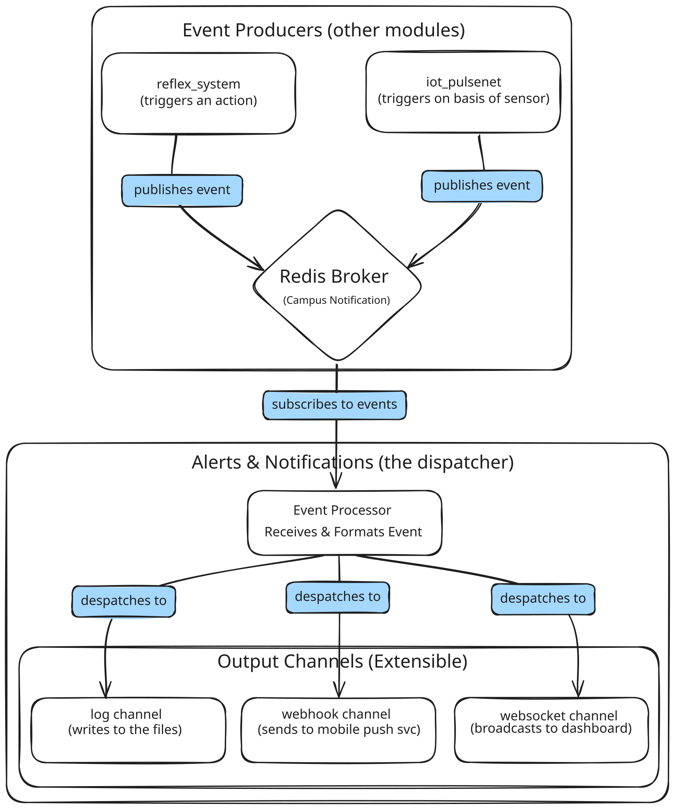

# 📢 Alerts & Notifications Service  
**The Central Dispatcher and Voice of the NeuraCity Platform**  

The `alerts_and_notifications` module is a critical piece of the NeuraCity infrastructure. It acts as a dedicated microservice that listens for important events from across the platform and dispatches them as polished, human-readable alerts to various **channels**, including user-facing frontends and logging systems.

It is designed to be the single, reliable gateway for all real-time communication, ensuring that when something important happens, the right people (or systems) are notified immediately.

---

## ✨ Core Features  

- 📡 **Real-Time Event Consumption**: Subscribes directly to the `campus_notifications` Redis channel, processing events the instant they are published by modules like `reflex_system`.  
- ✍️ **Intelligent Message Formatting**: Uses a system of configurable templates to transform raw, structured event data into polished, human-readable messages tailored to the specific event type.  
- 🔌 **Multi-Channel Dispatch**: Built with a highly extensible, channel-based architecture to send notifications to multiple destinations simultaneously. The default channels are:  
  - **WebSocket Channel**: Broadcasts live alerts to all connected frontend clients, such as the Admin Dashboard.  
  - **Webhook Channel**: Pushes a full event payload to an external URL, perfect for integrating with third-party push notification services (e.g., for mobile apps).  
  - **Log Channel**: Writes a copy of every notification to a persistent `notifications_sent.log` file for easy auditing and debugging.  
- 🛡️ **Robust and Resilient**: Designed as a standalone FastAPI service. It can handle client disconnects gracefully and is resilient to malformed event data, ensuring the core service remains online.  
- 💻 **Frontend-Ready**: Provides a secure and standard WebSocket endpoint (`/ws/alerts`) that any modern web application can connect to, making frontend integration straightforward.



---

## 🛠️ Technology Stack  

- **Backend Framework**: FastAPI  
- **Real-time Communication**: Redis (via `aioredis`) & WebSockets  
- **External Communication**: `httpx` (for Webhooks)  

---

## 🏗️ Project Structure  

The module's architecture cleanly separates the core processing logic from the individual delivery channels.
```bash
modules/alerts_and_notifications/
├── main.py                    # The main FastAPI server and WebSocket endpoint
├── event_processor.py         # Core logic for formatting and dispatching events
├── channels/
│   ├── base_channel.py        # Abstract Base Class for all channel types
│   ├── log_channel.py         # Channel for writing to a local file
│   ├── webhook_channel.py     # Channel for sending data to an external URL
│   └── websocket_manager.py   # Manages all active dashboard WebSocket connections
└── utils/
  └── config.py              # Configuration for Redis, webhooks, and message templates
```

---

## ▶️ How to Run  

The `alerts_and_notifications` service is a core component and should be run continuously.

1. **Prerequisites**: Ensure that Redis is running (e.g., via Docker).  
2. **Activate Environment**:
   ```bash
   source venv/bin/activate
   ```
3. **Start the Server**:
   ```bash
   python3 -m uvicorn modules.alerts_and_notifications.main:app --host 0.0.0.0 --port 8003 --reload
   ```
4. **Verification**:
   The server is running successfully when you see the log message:
   ```bash
   [Alerts Main] Successfully subscribed to Redis channel 'campus notifications'. Waiting for events...
   ```

---

## 🔗 How to Integrate Frontends (The API Contract)

### Connecting the Admin Dashboard (via WebSockets)

The dashboard should establish a WebSocket connection to the server on startup to receive a live feed of alerts.

Endpoint URL:
```
ws://<your_server_ip>:8003/ws/alerts
```
Example Frontend JavaScript:
```bash
// This code would run inside your React, Vue, or Angular dashboard application.
const socket = new WebSocket("ws://localhost:8003/ws/alerts");

socket.onopen = () => {
  console.log("✅ WebSocket connection established with NeuraCity Alerts.");
};

socket.onmessage = (event) => {
  // A new alert has been pushed by the server.
  const alertData = JSON.parse(event.data);
  
  console.log("🚨 New Alert Received:", alertData.human_readable_message);
  
  // You can now use this data to update the UI:
  // - Show a pop-up toast notification.
  // - Add a new row to a live alert feed table.
  // - Use the 'raw_event_data' to display a specific icon or update a map.
};

socket.onclose = () => {
  console.log("WebSocket connection closed. Attempting to reconnect...");
  // Implement reconnection logic here.
};
```

## Integrating the Mobile App (via Webhooks)

For mobile push notifications, configure this module’s webhook channel to point to your own dedicated push notification “bridge” service.

	1.	Open modules/alerts_and_notifications/utils/config.py.
 
	2.	Set the WEBHOOK_URL to the endpoint of your push notification service (e.g., an AWS Lambda function that triggers Firebase/APNs).

---

## 🚀 How to Extend (Adding a New Notification Channel)

The modular design makes adding new notification types (e.g., Email, SMS) incredibly simple.
	1.	**Create the Channel:**
In the channels/ directory, create a new file (e.g., email_channel.py). Inside, create a new class EmailChannel that inherits from BaseChannel and implements the:
```
async def send(...)
```
method with your email-sending logic.

  2.	**Register the Channel:**
In event_processor.py, import your new EmailChannel and add an instance of it to the self.channels list in the __init__ method.

That’s it — the EventProcessor will now automatically send every processed event to your new email channel in addition to all the others.
