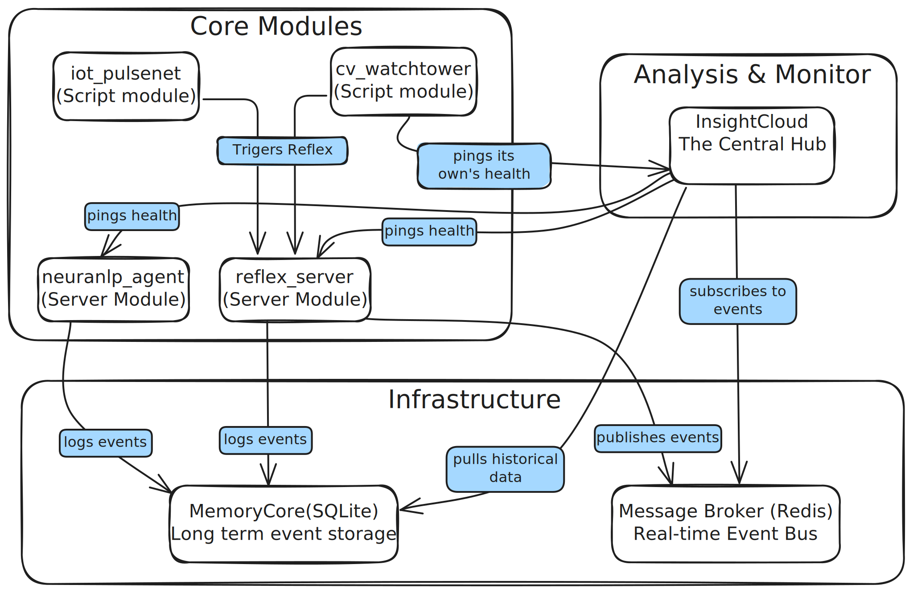

# ☁️ InsightCloud: The Consciousness of NeuraCity
The centralized analytics, visualization, and health monitoring backend for the NeuraCity Smart Campus project.

## 🏛️ Architectural Purpose
InsightCloud serves as the central nervous system and awareness layer for the entire NeuraCity platform. It ingests data from all other active modules to provide a single source of truth for the platform's historical performance, real-time activity, and operational health.

Its primary function is to be the dedicated data provider for the future NeuraCity Admin Dashboard, offering everything from high-level statistics to live event monitoring and anomaly detection.

---

## ✨ Core Capabilities
- 📈 Historical Analytics: Connects to the centralized MemoryCore to pull and cache structured event data. It can instantly serve aggregated statistics like:
  - Total events per day.
  - Event breakdowns by source module (cv_watchtower, reflex_system, etc.).
- 🤖 Anomaly Detection: Employs an IsolationForest machine learning model to automatically analyze event frequency and detect unusual spikes, helping to identify potential large-scale incidents.
- 📡 Real-Time Monitoring: Subscribes directly to the Redis event bus to process live events the moment they are published, providing an up-to-the-second overview of campus activity.
- ❤️ Hybrid Health Checking: Implements a sophisticated, dual-strategy health monitoring system:
  - Active Pinging: Periodically sends HTTP requests to all server-based modules (neuranlp_agent, reflex_system) to ensure they are online and responsive.
  - Passive Heartbeating: Provides a dedicated API endpoint for script-based modules (cv_watchtower) to report their own health, confirming they are alive and processing data.
- 🔌 Extensible by Design: Architected to seamlessly integrate future modules like IoT_PulseNet with minimal to no code changes required in InsightCloud itself.

## 🛠️ Technology Stack
```bash
Backend Framework: FastAPI
Data Analysis: pandas
Machine Learning: scikit-learn (for anomaly detection)
Real-time Communication: Redis (via aioredis)
API Client: httpx (for active health checks)
```

---

## 🔗 How It Integrates
InsightCloud is a master aggregator and a perfect example of a decoupled microservice. It initiates connections but has no dependencies on the internal code of other modules.



---

## ▶️ How to Run

InsightCloud is designed to be a continuous, standalone service.

**Prerequisites:** Ensure Redis is running via Docker and that other NeuraCity modules (reflex_system, neuranlp_agent) are ready to be run.
Activate Environment: Open a terminal, navigate to the NeuraCity project root, and activate the virtual environment (source venv/bin/activate).
Start the Server: Use the following command to launch the service. It is configured to run on port 8002 to avoid conflicts.
```bash
python3 -m uvicorn modules.insightcloud.app:app --host 0.0.0.0 --port 8002 --reload
```
View the API: You can now access the interactive API documentation at http://localhost:8002/docs.

---

## 📖 API Endpoints
All endpoints provide clean JSON responses ready for a frontend dashboard.

```bash
GET /stats/module_health: Returns the real-time health status (Healthy, Unhealthy, Unknown) of all registered NeuraCity modules.
GET /stats/realtime_overview: Provides a live snapshot of events that have occurred since the server started.
POST /system/refresh_cache: Manually triggers a refresh of the historical analytics data from MemoryCore.
GET /stats/events_per_day: Returns a JSON object of total historical event counts grouped by day.
GET /stats/events_by_module: Returns a JSON object of total historical event counts grouped by the source module.
GET /stats/anomalies: Identifies and returns any time periods that have had an anomalous spike in event activity.
POST /health/ping/{module_name}: An internal endpoint used by script-based modules like cv_watchtower to report their own health.
```

---

## 🚀 How to Extend for Future Modules

The system is designed for effortless extension.

- Ensure New Module Logs to MemoryCore:
- The new module must call **get_memory_core().structured.add(...)** to log its sensor readings.
  This will automatically make its data available to InsightCloud's historical analytics.
- Add to Health Checker: In modules/insightcloud/healthcheck.py,
  simply update the registered_modules dictionary to include the new module's name
  and type ("event_driven" or "server"). No other code changes are needed.
```bash
# in healthcheck.py
'iot_pulsenet':   {"type": "event_driven", "last_seen": 0.0, "status": "Unknown"}
```
That's it. The system is architected to discover and monitor new modules automatically with minimal configuration.
