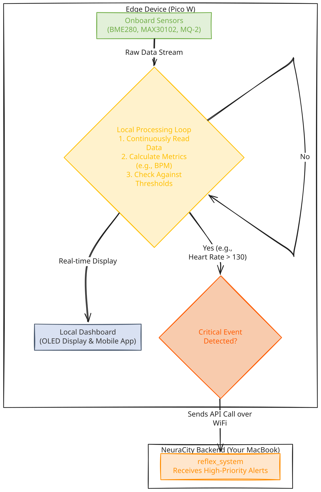

# ⚡ IoT PulseNet Module

> The Real-Time IoT Sensor and Edge Intelligence Node for the NeuraCity Platform.

The `iot_pulsenet` module is a complete, standalone MicroPython application designed to run on a **Raspberry Pi Pico W**. It acts as an intelligent "edge" device, continuously monitoring a suite of environmental and biometric sensors.

Crucially, it embodies an **Edge Intelligence** architecture: it processes data locally and only communicates with the main NeuraCity backend when a critical, user-defined event is detected. This makes it incredibly efficient, private, and resilient.

---

## 🏛️ Architectural Role

`IoT_PulseNet` functions as a distributed sensory organ for the NeuraCity nervous system. Unlike passive sensors, it has its own onboard logic to decide what is important.



---

## ✨ Core Features
- Multi-Sensor Fusion: Integrates a variety of sensors to build a comprehensive picture of the local environment and user status:
  - BME280: Temperature, Humidity, and Barometric Pressure.
  - MAX30102: Pulse Oximetry (Heart Rate).
  - MQ-2 (via MCP3008): Detects combustible gases and smoke.
- 🧠 Edge Intelligence: To save power and network bandwidth, the device processes sensor data locally. It only contacts the main NeuraCity backend when a critical threshold is breached (e.g., heart rate too high, gas detected).
- 🌐 WiFi Connectivity: Connects to a local WiFi network to send critical alerts to the reflex_system's API endpoint.
- 📊 Local Dashboard: Utilizes an onboard SSD1306 OLED screen to provide a real-time, at-a-glance display of all sensor readings, viewable by the user.
- 💡 Visual Feedback: Uses an onboard NeoPixel LED for clear status indication (e.g., Blue for booting, Green for WiFi connected, Red for a critical event).
- 🔌 Autonomous Operation: With the included boot.py, the module is configured to start automatically as soon as the Pico W is powered on.

---

## 🛠️ Hardware & Wiring

This script is designed for a Raspberry Pi Pico W with the following pin connections:

| Sensor/Device	| Interface	Pin Connections                             |
|---------------|-------------------------------------------------------|
| OLED (SSD1306)|	I2C Bus 0	SDA: GP4, SCL: GP5                          |
| BME280	      |I2C Bus 0	SDA: GP4, SCL: GP5                          |
| MAX30102	    |I2C Bus 1	SDA: GP2, SCL: GP3                          |
| MCP3008 (ADC) |	SPI Bus 1	SCK: GP10, MOSI: GP11, MISO: GP12, CS: GP13 |
| NeoPixel LED  |	GPIO	Data: GP16                                      |

---

## ⚙️ Setup and Deployment

1. **Flash MicroPython**:

Ensure your Raspberry Pi Pico W is flashed with the latest version of the MicroPython firmware. An IDE like Thonny is highly recommended for an easy setup.

2. **Configure User Settings**:

Before deploying, you must edit the iot_pulsenet/main.py script and fill in your local configuration details at the top of the file:
```bash
WIFI_SSID: Your WiFi network name.
WIFI_PASSWORD: Your WiFi password.
SENSOR_ID: A unique name for this device (e.g., "PicoW-User-Swayam").
YOUR_IP: The local IP address of the computer running the main NeuraCity backend services (e.g., "192.168.1.101").
```

3. **Deploy the Code via Thonny**:

Using Thonny is the most straightforward way to manage files on your Pico.

- Connect Thonny to your Pico W interpreter.
- Navigate to the Pico's file system (Raspberry Pi Pico).
- Create a /lib directory on the Pico if it doesn't exist.
- Upload the five required driver files into the /lib directory:
  ```bash
  ssd1306.py
  bme280.py
  max30102.py
  neopixel.py
  urequests.py
  ```
- Upload the main.py and boot.py files from this module to the root directory of the Pico W.

4. **Run the Module**:

Simply reset the Pico W (Ctrl+D in the Thonny REPL) or plug it into a power source. The boot.py file will automatically execute main.py, and the device will connect to your WiFi and begin monitoring. You can view its real-time console output in the Thonny shell.

