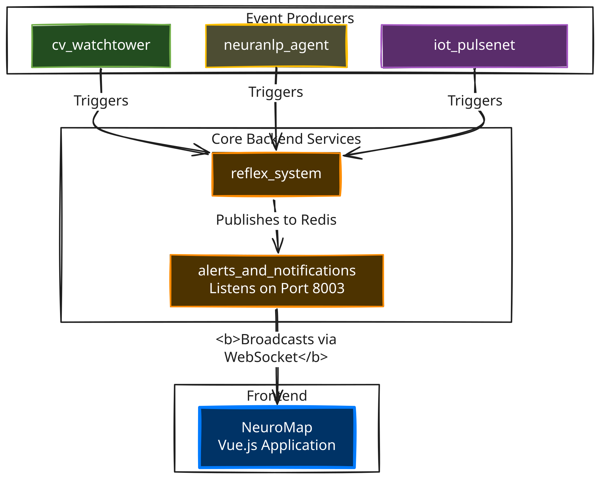

# 🗺️ NeuroMap: The Visual Cortex of NeuraCity

> The real-time, interactive, and visually breathtaking map interface for the NeuraCity platform.

The `NeuroMap` module is the primary visual interface for the entire NeuraCity ecosystem. It provides a "single pane of glass" for operators to monitor real-time events, understand the spatial context of alerts, and witness the intelligence of the platform as it unfolds.

It is designed for maximum visual appeal, seamless real-time interactivity, and minimal latency, transforming raw data from across the campus into a captivating and immediately understandable operational picture.

---

## ✨ Core Features

*   **🌐 Interactive, Real-Time Map**: Built with a beautiful, dark-themed **OpenStreetMap** layer powered by the high-performance **Leaflet.js** library.
*   **📡 Live WebSocket Integration**: Connects directly to the `alerts_and_notifications` service's WebSocket. Events detected by any module (`cv_watchtower`, `neuranlp_agent`, etc.) are displayed on the map **instantly** without needing a refresh.
*   **💥 Dynamic, Animated Event Markers**: Critical events appear on the map as visually stunning, pulsing markers with unique icons and colors corresponding to the event type.
*   **✈️ Cinematic "Fly-To" Animation**: When a new high-priority alert appears, the map automatically and smoothly animates its viewpoint to center on the event, drawing the operator's immediate attention.
*   **🧠 Intelligent Event Filtering**: The frontend is smart. It contains a "whitelist" of location-based, map-worthy event types. This ensures the map remains clean and focused on critical security and safety alerts, while non-spatial events (like high heart rates without a location) are correctly ignored.
*   **ℹ️ Interactive Popups**: Every marker is clickable, revealing a popup with a clean, human-readable summary of the event details.
*   **✅ Robust & Standalone**: Architected as a modern **Vue.js** single-page application, served by a lightweight FastAPI backend.

---

## 🛠️ Technology Stack

*   **Backend Server**: `FastAPI` (for serving the frontend)
*   **Frontend Framework**: `Vue.js 3` (with Vite)
*   **Mapping Library**: `Leaflet.js` (via `@vue-leaflet/vue-leaflet`)
*   **Map Tiles**: `OpenStreetMap` (via CartoDB's free dark theme)
*   **Real-time Communication**: `WebSockets`

---

## 🏗️ How It Integrates

`NeuroMap` is a pure **Event Consumer**. It brilliantly demonstrates the power of the decoupled NeuraCity architecture. It has no direct knowledge of any other module except for the `alerts_and_notifications` service.



---

## ▶️ How to Run
Running the NeuroMap requires two stages: building the frontend and then serving it.

1. **Prerequisites**

Node.js and npm must be installed.
All other NeuraCity backend services (Redis, reflex_system, alerts_and_notifications, etc.) must be running.

2. **Install Frontend Dependencies (One-Time Setup)**

```bash
# Navigate to the frontend directory
cd modules/neuromap/frontend

# Install all required packages (Vue, Leaflet, etc.)
npm install
```
3. **Build the Frontend Application (Required before first run or after changes)**

This command compiles the Vue.js code into a set of optimized, static HTML, CSS, and JavaScript files in a dist/ directory.
```bash
# Inside the modules/neuromap/frontend directory
npm run build
```
4. **Run the Local Development Server (For Active Development)**

For making live changes, the Vite development server is best.
```bash
# Inside the modules/neuromap/frontend directory
npm run dev
```
The map will be available at the URL provided (usually ``http://localhost:5173/``).

5. **Run the Production Server (For Showcase)**

This serves the built, optimized files using the Python FastAPI server.
```bash
# In the NeuraCity project root, with (venv) active
python3 -m uvicorn modules.neuromap.server:app --host 0.0.0.0 --port 8004
```
The final, production-ready map is now available at ``http://localhost:8004/``.