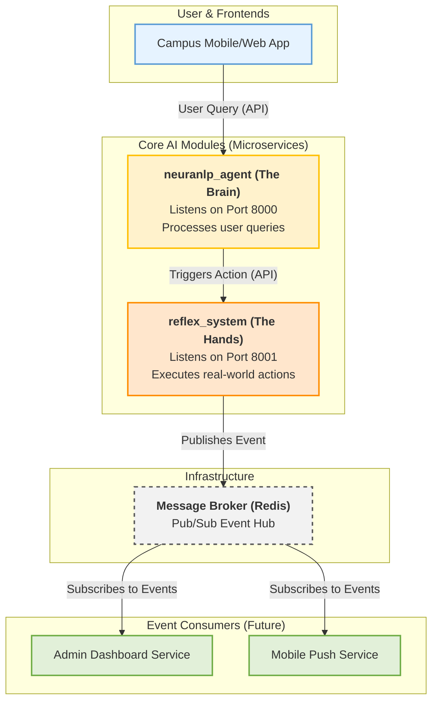

# 🏙️ NeuraCity: A Smart Campus Nervous System

Welcome to NeuraCity, a modular, multi-agent AI platform designed to be the intelligent core of a modern smart campus. This project leverages Generative AI to understand and respond to the needs of students and staff, creating a seamless, responsive, and safe campus environment.

---

## 🏛️ High-Level Architecture

NeuraCity is built on a decoupled, microservices-style architecture. Each core functionality is encapsulated in a **module**, which runs as an independent service and communicates with others via robust APIs and a central event bus.

This design ensures scalability, maintainability, and resilience.



---

## ✨ Core Modules

### 1. **`neuranlp_agent` (The Brain)**
*   The primary user-facing AI assistant.
*   Listens on port `8000`.
*   Processes text and voice queries, uses LangChain and Gemini for reasoning, and maintains conversational memory.
*   When a real-world action is required, it makes an API call to the `reflex_system`.

### 2. **`reflex_system` (The Hands)**
*   The action-execution engine of NeuraCity.
*   Listens on port `8001`.
*   Exposes secure endpoints that, when called, perform critical tasks (e.g., dispatching security, sending notifications).
*   Upon executing an action, it publishes a structured event to the central Redis message bus, allowing any number of other services (like dashboards or mobile apps) to react in real-time.

---

## 🛠️ Technology Stack

*   **Primary Language**: Python 3.9+
*   **Backend Framework**: FastAPI
*   **AI Orchestration**: LangChain
*   **Primary LLM**: Google Gemini (`gemini-1.0-pro`)
*   **Fallback LLM**: Ollama (`mistral`)
*   **Vector Database**: ChromaDB (for `neuranlp_agent`'s local memory)
*   **Event Broker / Cache**: Redis
*   **Speech-to-Text**: OpenAI Whisper
*   **Text-to-Speech**: gTTS
*   **Containerization**: Docker (for running Redis)

---

## ⚙️ Full System Setup and Installation

This guide will get the entire NeuraCity platform running on your local machine.

### 1. Prerequisites

*   Python 3.9+ and `pip`
*   An active **Google AI Studio API key** for Gemini.
*   **Docker Desktop**: Must be installed and running.
*   **(Optional)** For LLM fallback, [Ollama](https://ollama.com/) must be installed and running with the `mistral` model (`ollama pull mistral`).

### 2. Initial Setup

All commands should be run from the project's root directory (`NeuraCity/`).

```bash
# 1. Create a Python virtual environment
python3 -m venv venv

# 2. Activate the virtual environment
# On macOS/Linux:
source venv/bin/activate
# On Windows:
venv\Scripts\activate

# 3. Install all project dependencies from the single root file
pip install -r requirements.txt
```

### 3. Environment Variables
Create a file named .env in the project root directory.

.env file:

```bash
# REQUIRED: Your Google AI Studio API key
GEMINI_API_KEY="your_google_api_key_here"

# Set this to avoid warnings from the tokenizer library in a server environment
TOKENIZERS_PARALLELISM=false

# OPTIONAL: Default URLs are configured in the code.
# OLLAMA_BASE_URL="http://localhost:11434"
# REFLEX_API_BASE_URL="http://localhost:8001/api"
```

▶️ Running the NeuraCity Platform
The full system requires three terminals running simultaneously.

Terminal 1: Start the Redis Message Broker
# This command downloads and runs a Redis container in the background.
# You only need to run this once.
```bash
docker run -d --name neura-redis -p 6379:6379 redis/redis-stack-server:latest
```
To confirm Redis is running, use the **docker ps** command.

Terminal 2: Start the reflex_system
```bash
# Ensure your (venv) is active
python3 -m uvicorn modules.reflex_system.main:app --host 0.0.0.0 --port 8001 --reload
```
The action engine is now live at http://localhost:8001.

Terminal 3: Start the neuranlp_agent
```bash
# Ensure your (venv) is active
python3 -m uvicorn modules.neuranlp_agent.main:app --host 0.0.0.0 --port 8000 --reload
```

# The AI brain is now live.

---

## 🧪 Testing the Full System
With all services running, you can test the entire pipeline.
Interact with the Agent:
Open a web browser and navigate to the agent's interactive API documentation:
http://localhost:8000/docs

Optional - Monitor Events (in a 4th terminal):
To see the real-time events published by the reflex_system, open a new terminal and subscribe to the Redis channel:

```bash
# Connect to the redis CLI running inside the docker container
docker exec -it neura-redis redis-cli
# Once inside the redis prompt, subscribe to the channel
SUBSCRIBE campus_notifications
```
This terminal will now print any events as they happen.

Perform a Test Query:
In the browser docs for the agent, send a POST /query request that triggers an action:
query: "There is an emergency in the main library, send help immediately."
mode: "text"
You have successfully tested the system when you observe the following:

✅ The browser gets a 200 OK success response from the agent.
✅ The neuranlp_agent terminal shows the agent's reasoning process.
✅ The reflex_system terminal shows it received an API call and published an event.
✅ The redis-cli subscriber terminal prints the JSON payload of the event.
✅ Unit Testing
This project includes unit tests for the reflex_system to ensure its reliability.

To run the tests:
```bash
# Ensure your (venv) is active and you are in the project root
pytest
```
