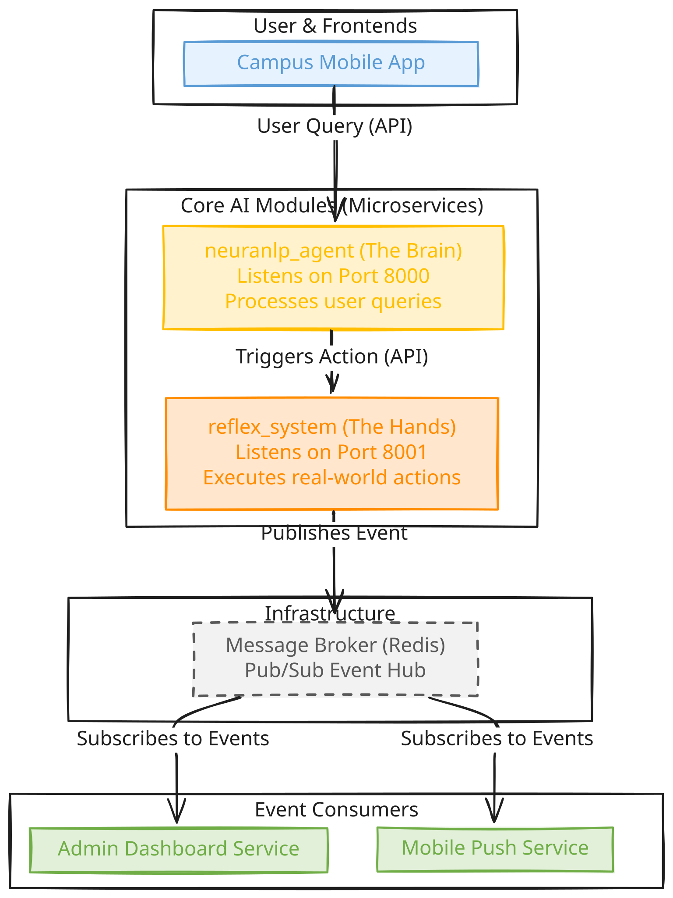

# 🦾 Reflex System: The AIOps Engine of NeuraCity

> The autonomous action, event-publishing, and self-monitoring engine of the NeuraCity Smart Campus platform.
> Co-created by Swayam and his wife.

The `reflex_system` is a dedicated microservice that acts as the hands and central nervous system of the NeuraCity platform. Its primary role is to receive authenticated commands from other modules (like `neuranlp_agent` or `cv_watchtower`) and execute them as real-world actions.

Crucially, it is also an **intelligent AIOps agent**. It actively monitors the health of the entire NeuraCity ecosystem and can autonomously trigger alerts if a critical component fails, creating a resilient, self-monitoring platform.

---

## ✨ Core Capabilities

*   **🛡️ Secure Action Endpoints**: Provides a set of well-defined, Pydantic-validated API endpoints (`/api/actions/...`) for critical campus operations.
*   **📡 Real-Time Event Broadcasting**: Upon executing an action, it publishes a structured, context-aware event to the central **Redis message bus**. This allows any number of services (like `InsightCloud` or a live dashboard) to be notified of real-time actions.
*   **✍️ Auditable, Dual-Backend Logging**: Every action it takes is logged to two places for robustness:
    1.  A local `system_action_log.txt` file for immediate, human-readable auditing.
    2.  The centralized `MemoryCore` (SQLite) for long-term, structured storage and historical analysis.
*   **🤖 Autonomous Health Monitoring (AIOps)**: Runs a background task that periodically polls the `InsightCloud` module to get a system-wide health report. If a critical module is detected as "Unhealthy" for a sustained period, it will **autonomously trigger an alert** to an SRE (Site Reliability Engineering) team.
*   **🔬 Independently Testable**: Comes with a suite of `pytest` unit tests to guarantee its logic and API contracts are stable and reliable.



---

## 🛠️ Technology Stack

*   **Backend Framework**: `FastAPI`
*   **Asynchronous HTTP Client**: `httpx` (for calling `InsightCloud`)
*   **Data Validation**: `Pydantic`
*   **Event Publishing**: `Redis`
*   **Logging**: `MemoryCore` Integration

---

## 🏗️ Project Structure

The module is designed for a clean separation of concerns.

```bash
modules/reflex_system/
├── main.py                # FastAPI app, API routes, and lifespan manager
├── action_handlers.py     # Core business logic for executing actions
├── health_monitor.py      # The background AIOps self-monitoring task
├── event_publisher.py     # Manages the connection and publishing to Redis
├── models.py              # Pydantic models for API request validation
└── utils/
    └── logger.py          # Centralized logging configuration
```

---

## ▶️ How to Run

The reflex_system is designed to be a continuous, standalone service and a core component of the NeuraCity platform.

1.  **Prerequisites**: Ensure that **Redis** is running (e.g., via Docker) subscribe to its notifications.
    ```bash
    docker run -d --name neura-redis -p 6379:6379 redis/redis-stack-server:latest
    docker exec -it neura-redis redis-cli
      > SUBSCRIBE campus_notifications
    ```
2.  **Activate Environment**: Open a terminal, navigate to the `NeuraCity` project root, and activate the virtual environment (`source venv/bin/activate`).
3.  **Start the neuranlp_agent**: Use the following command to start the GenAi agent. It is configured to run on port `8000`.
    ```bash
    python3 -m uvicorn modules.neuranlp_agent.main:app --host 0.0.0.0 --port 8000 --reload
    ```
4.  **Start the Server**: Use the following robust command to launch the service. It is configured to run on port `8001`.

    ```bash
    python3 -m uvicorn modules.reflex_system.main:app --host 0.0.0.0 --port 8001 --reload
    ```
5.  **Health Check**: You can verify that the service is running by navigating to **`http://localhost:8001/`** in your browser, where you should see an operational status message. The full interactive API documentation is available at **`http://localhost:8001/docs`**.

---

## 🔗 Integration Workflow

This module is the central action hub.

- Receives Commands: Other modules (like neuranlp_agent or cv_watchtower) trigger it by making a POST request to its API endpoints.
- Executes Logic: The action_handlers.py file performs the requested action.
- Logs History: It writes a record of the action to the central MemoryCore.
- Broadcasts Real-Time Event: It publishes a message to the campus_notifications Redis channel, which is consumed by InsightCloud and alerts_and_notifications.
- Monitors System: In the background, it periodically fetches health data from InsightCloud to ensure the entire platform is stable.


### ✅ Unit Testing
The project includes unit tests to ensure the reliability of the API endpoints.

To run the tests:
```bash
# Ensure your (venv) is active and you are in the project root
pytest
```